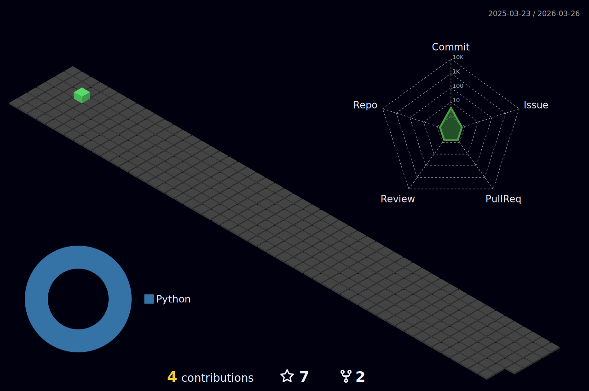

<h1 align="center", font-size="bold">
Welcome to my github profile 👾
</h1>

<h1 align="center", font-size="bold">
<h1 align="center", font-size="bold">
Stats 📈
</h1>

🧩 Little binary quiz 🧩
</h1>
00111001 00100000 01101111 01110101 01110100 00100000 01101111 01100110 00100000 00110001 00110000 00100000 01110000 01100101 01101111 01110000 01101100 01100101 00100000 01110100 01110010 01100001 01101110 01110011 01101100 01100001 01110100 01100101 00100000 01110100 01101000 01101001 01110011 00100000 01110100 01100101 01111000 01110100 00100000 01110101 01110011 01101001 01101110 01100111 00100000 01100001 00100000 01100011 01101111 01101110 01110110 01100101 01110010 01110100 01100101 01110010 00101110 00100000 01001001 00100000 01101000 01101111 01110000 01100101 00100000 01111001 01101111 01110101 00100000 01100001 01110010 01100101 00100000 01110100 01101000 01100001 01110100 00100000 00110001 00100000 01101111 01110101 01110100 00100000 01101111 01100110 00100000 00110001 00110000

<!---
matiwan3/matiwan3 is a ✨ special ✨ repository because its `README.md` (this file) appears on your GitHub profile.
You can click the Preview link to take a look at your changes.
--->
