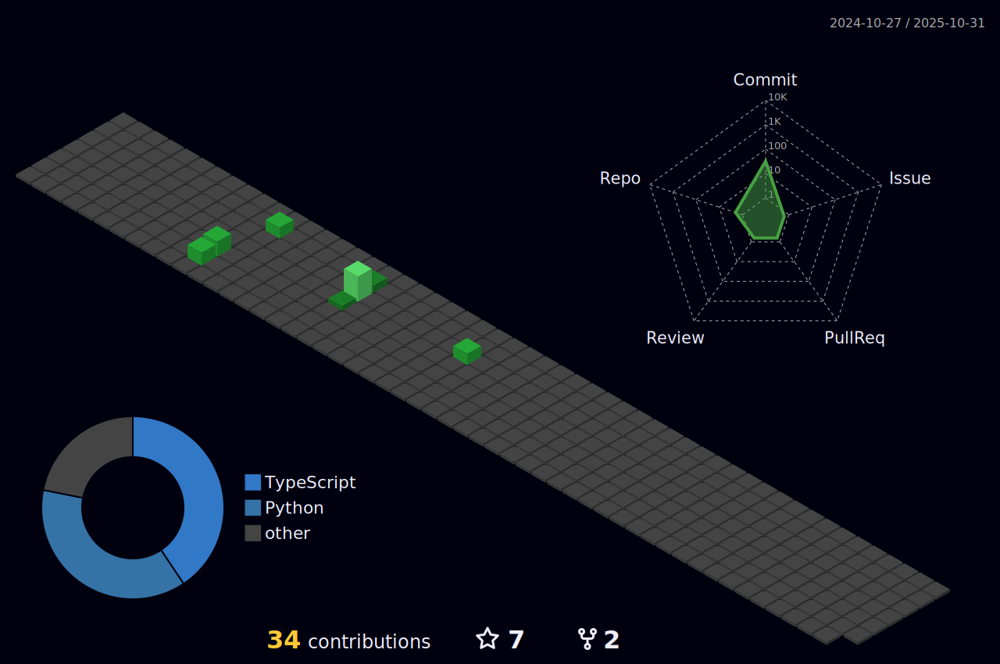

# Hello there!
My name is Matheus (Mateusz in Polish), but you can call me whatever you like — I enjoy coming up with nicknames 😎. I have been fascinated by technology since I was a child, when it seemed like a magical mystery to me 🔮. A few years ago, I discovered Python and other programming languages, which opened my eyes to the power and capabilities of programming. I fell in love with automation, as it allowed me to streamline simple daily tasks and save a lot of time.
What I truly enjoy about programming is the limitless potential for creating and developing my own tools, as well as the opportunity to collaborate, share knowledge, and work on exciting projects with other enthusiasts. 

  **Additional thought** 💡 
It's fascinating to think that I'm currently typing on a keyboard — a piece of plastic powered by electricity  —  to write this description. The world around me is full of undiscovered wonders, and there's always something new to learn.
This curiosity drives me to constantly explore and understand how things work. I believe this ability to see the bigger picture and dive deep into learning is incredibly valuable. I'm eager to continue discovering and understanding new concepts, not just memorizing information but truly grasping the underlying principles to become better version of myself everyday on...
 

## Personal overview based on Gallup & CliftonStrengths
1.  Activator ✅
> _People exceptionally talented in the Activator theme can make things happen by turning thoughts into action. They want to do things now, rather than simply talk about them._
2. Futuristic 🚀
> _People exceptionally talented in the Futuristic theme are inspired by the future and what could be. They energize others with their visions of the future._
3. Command 🫡
> _People exceptionally talented in the Command theme have presence. They can take control of a situation and make decisions._
4. Significance 🙋
> _People exceptionally talented in the Significance theme want to make a big impact. They are independent and prioritize projects based on how much influence they will have on their organization or people around them._
5. Restorative 🛠️
> _People exceptionally talented in the Restorative theme are adept at dealing with problems. They are good at figuring out what is wrong and resolving it._
 

## Projects and ongoing work
<ul>
<li><a href="https://github.com/matiwan3/project-scripts-and-scrappers/tree/main/john%20talks")>JohnTalks - speach recognition project</li>
<li><a href="https://github.com/matiwan3/LEDisplay"> Rasberry Pi + LED display + python </li>
<li><a href="https://github.com/matiwan3/autogit-streak"> Automated github contributions </li>
<li><a href="https://github.com/matiwan3/local_projects-HTML-CSS-JAVASCRIPT"> JavaScript repo with projects </li>
<li><a href="https://github.com/matiwan3/Instagram-Followers-Follower"> Instagram-Followers-Follower - project for tracking instagram followers changes </li>
</ul>
  

## Contributions section 📅

*Do you see that green carpet in the photo above? This was achieved thanks to <a href="https://github.com/matiwan3/autogit-streak"> this script </li>

   

  
